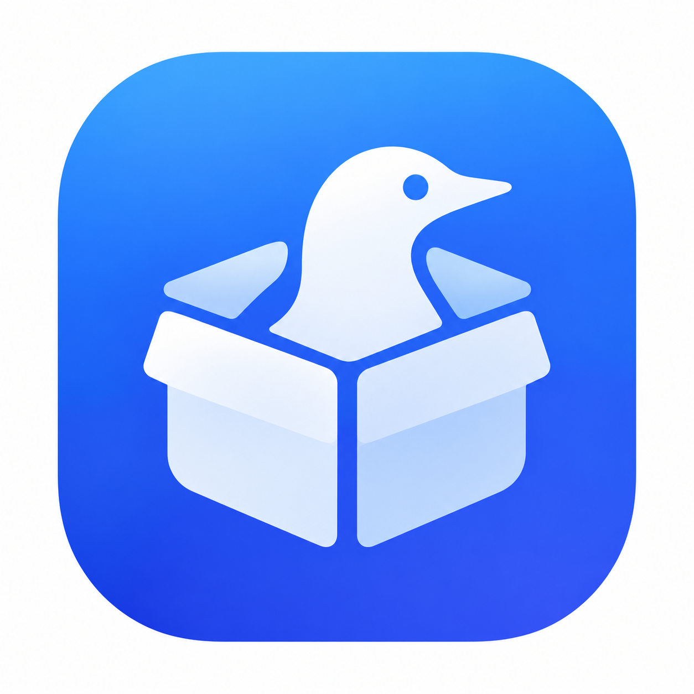

<a id="top"></a>

<div align="center">



# MyLoon

**[Loon](https://www.nsloon.com/) 插件合集与在线安装平台**<br>
**A curated collection of Loon plugins with a web-based installer**

[](LICENSE)
[](https://github.com/OliviaR13/MyLoon/commits/main)
[](plugin/)

**[简体中文](#zh)** &nbsp;·&nbsp; **[English](#en)**

### [打开 Loon Box · Open Loon Box](https://olivia-loon-box.pages.dev/)

</div>

---

<a id="zh"></a>

## 简体中文

[English](#en) · [回到顶部](#top)

### 目录

- [项目简介](#zh-intro)
- [快速开始](#zh-install)
- [插件列表](#zh-plugins)
- [工作原理](#zh-how)
- [使用说明](#zh-usage)
- [常见问题](#zh-faq)
- [隐私说明](#zh-privacy)
- [仓库结构](#zh-structure)
- [自动化流程](#zh-ci)
- [贡献新插件](#zh-contribute)
- [免责声明](#zh-disclaimer)
- [致谢](#zh-credits)
- [许可](#zh-license)

<a id="zh-intro"></a>

### 项目简介

MyLoon 是一组面向 Loon 的网络规则与脚本插件，围绕三类场景设计：指定服务的**代理分流**、App 的 **IP 属地**信号控制，以及认证流程的**登录修复**。仓库同时提供 **Loon Box**——一个部署在 Cloudflare Pages 上的网页，可检索、收藏插件，并通过 `loon://import` 一键唤起 Loon 完成安装。

> 本仓库的插件、脚本与网页主要借助 Claude、ChatGPT 等 AI 工具辅助编写。使用前请自行审阅规则内容。

<a id="zh-install"></a>

### 快速开始

**方式一：Loon Box（推荐）**

1. 使用系统浏览器打开 [Loon Box](https://olivia-loon-box.pages.dev/)（微信内置浏览器无法唤起 Loon，请先在默认浏览器中打开）。
2. 完成人机验证后浏览或搜索插件，点击「安装」，由 `loon://import?plugin=...` 唤起 Loon 完成导入。
3. 可登录 GitHub 账号，在多台设备间同步收藏与界面偏好。

**方式二：手动添加**

1. 在 [`plugin/`](plugin/) 中找到目标文件，复制其 raw 链接：

   ```text
   https://raw.githubusercontent.com/OliviaR13/MyLoon/main/plugin/<文件名>.plugin
   ```

2. 打开 Loon → 插件 → 右上角 `+` → 粘贴链接 → 添加。

<a id="zh-plugins"></a>

### 插件列表

<!-- PLUGINS_ZH:START -->
| 插件 | 分类 | 说明 |
|---|---|---|
| [示例 自选节点](plugin/Example.plugin) | 代理分流 | 功能说明 |
| [Gemini 自选节点](plugin/Gemini.plugin) | 代理分流 | Google Gemini（网页、App、API、AI Studio）相关域名统一走 `PROXY` |
| [Spotify 自选节点](plugin/Spotify.plugin) | 代理分流 | Spotify 官方站点、API、音频与图片 CDN、短链统一走 `PROXY` |
| [推特 自选节点](plugin/Twitter.plugin) | 代理分流 | Twitter / X（网页、App、图片视频 CDN、短链）统一走 `PROXY` |
| [抖音 自选节点](plugin/douyin_ip.plugin) | IP 属地 | 仅代理承载属地 / 风控判定信号的接口，媒体 CDN 直连 |
| [小红书 自选节点](plugin/rednotebook_ip.plugin) | IP 属地 | 仅代理带经纬度参数的推荐接口、设备指纹注册与打点上报接口，媒体 CDN 直连 |
| [微博增强｜属地分流 · 来源机型](plugin/weibo.plugin) | IP 属地 · 功能增强 | `api.weibo.cn` 走代理；可自定义发博、评论、转发时显示的来源机型（脚本） |
| [Blued 直连](plugin/blued.plugin) | 登录修复 | 接口、图片、推送域名统一直连，使出口 IP 一致，用于排查登录失效与收不到推送 |
| [Outlook 登录修复](plugin/outlook.plugin) | 登录修复 | Microsoft 认证相关域名直连并跳过 MITM，处理登录窗口反复弹出 |
<!-- PLUGINS_ZH:END -->

分类由插件头部的 `#!tag` 决定，Loon Box 取第一个标签作为主分类；`#!tag` 可用英文逗号写多个，例如 `#!tag = IP 属地,功能增强`。

<a id="zh-how"></a>

### 工作原理

插件通过 `[Rule]` 为指定域名选择走代理或直连，部分插件附带脚本：

```text
App 发出请求
 ├─ 命中插件规则 PROXY  → 走你在插件中选择的策略组或节点
 ├─ 命中插件规则 DIRECT → 直连
 └─ 未命中插件规则      → 继续匹配主配置规则
```

规则自上而下匹配，先命中者生效，因此插件须排在 `GEOIP,CN,DIRECT` 等国内直连规则之前。

**「IP 属地」类插件**只将承载属地 / 风控判定信号的接口（如带经纬度参数的推荐接口、设备指纹注册接口、打点上报接口）送入代理；Feed、图片、视频等媒体 CDN 全部直连，因此不占用代理流量，也不影响加载速度。

<a id="zh-usage"></a>

### 使用说明

| 事项 | 说明 |
|---|---|
| 选择节点 | 名称带「自选节点」的插件，需在插件详情页的「代理指向的策略」中选择策略组或节点；未选择时使用全局策略的第一个节点 |
| 节点类型 | 建议选择固定的单一节点（`select` 类型策略组）。`url-test` 等自动测速类型发生节点切换时，可能中断已建立的连接 |
| 规则顺序 | 插件须排在主配置的 `GEOIP,CN,DIRECT` 等国内直连规则之前 |
| MITM | 带脚本的插件（如微博增强）需在 Loon 中安装并信任 MITM 证书，并开启 MITM |
| 微博机型 | 切换机型后，请到微博「微博来源」中重新选择一次 |
| 插件叠加 | 若同时启用对相同域名做 MITM 解密或响应体改写的其他插件（如去广告类），各插件独立生效；出现异常时需分别排查 |

<a id="zh-faq"></a>

### 常见问题

**为什么叫「自选节点」？**
插件只声明哪些域名走代理，具体使用哪个节点由你在插件详情页自行选择。

**插件已安装但似乎没有生效？**
先确认插件排在 `GEOIP,CN,DIRECT` 等国内直连规则之前；带脚本的插件还需确认 MITM 已开启。

**连接偶尔失败是插件的问题吗？**
插件只决定走代理还是直连。连接被取消、重置或超时，原因可能在 App、节点、CDN 或链路等环节，插件规则无法判断，也无法修复。

<a id="zh-privacy"></a>

### 隐私说明

以下说明针对 Loon Box 网页：

- 不接入统计分析，不追踪用户，不收集浏览记录等个人隐私数据。
- 未登录时，收藏与偏好设置仅保存在本机浏览器。
- 登录仅通过 GitHub 授权读取公开资料（用户名、头像），不申请其他权限，也不保存 GitHub 访问令牌；登录状态为 30 天有效的签名 Cookie。
- 登录后，收藏与已开启同步的偏好设置按账号 ID 保存至 Cloudflare KV，用于多设备同步。
- 人机验证由 Cloudflare Turnstile 提供。

<a id="zh-structure"></a>

### 仓库结构

| 路径 | 内容 |
|---|---|
| [`plugin/`](plugin/) | Loon 插件（9 款） |
| [`script/`](script/) | 插件使用的脚本（微博来源机型） |
| [`box/`](box/) | Loon Box 前端源码（HTML / CSS / JS） |
| [`functions/`](functions/) | Cloudflare Pages Functions：清单接口、GitHub OAuth、云端同步、人机验证 |
| [`icon/`](icon/) | 图标资源 |
| [`manifest.json`](manifest.json) | 插件清单，由 GitHub Actions 自动生成，请勿手动编辑 |
| [`.github/workflows/`](.github/workflows/) | 清单生成工作流 |

<a id="zh-ci"></a>

### 自动化流程

向 `main` 分支推送 `plugin/*.plugin` 或工作流本身的变更后，GitHub Actions 将：

1. 扫描 `plugin/` 下全部 `.plugin` 文件，解析头部元数据（`#!name`、`#!desc`、`#!tag`、`#!version` 等）；
2. 重新生成 `manifest.json`，使用默认 `GITHUB_TOKEN` 提交回仓库（避免触发循环）；
3. Cloudflare Pages 检测到仓库更新后自动重新部署 Loon Box。

没有 `#!tag` 的插件按工作流中的文件名映射表归类；映射表中也没有的，归入「其他」。

<a id="zh-contribute"></a>

### 贡献新插件

1. 将 `.plugin` 文件放入 `plugin/`，配套脚本放入 `script/`。
2. 在文件头部填写元数据：

   ```text
   #!name = 示例 自选节点
   #!desc = 功能说明
   #!tag = 代理分流
   #!author = @OliviaR13
   #!icon = https://example.com/icon.png
   #!version = 1.0.0
   ```

3. 提交到 `main` 分支，其余交由 Actions 处理。

<a id="zh-disclaimer"></a>

### 免责声明

本仓库内容基于个人使用场景编写，主要由 AI 辅助生成，不保证适用于所有网络环境与账号状态。仅供个人学习交流，请遵守相关 App 的用户协议。因使用本仓库内容导致的账号或网络问题，作者不承担责任。

<a id="zh-credits"></a>

### 致谢

| 类别 | 项目 | 用途 |
|---|---|---|
| 文档 | [Loon 插件文档](https://nsloon.app/docs/Plugin/) | 插件头部字段、`[Argument]` 与 `#!tag` 写法 |
| 文档 | [SunsetMkt/anti-ip-attribution](https://github.com/SunsetMkt/anti-ip-attribution) | 规则思路参考 |
| 素材 | [Koolson/Qure](https://github.com/Koolson/Qure) | 插件图标 |
| 素材 | [luestr/IconResource](https://github.com/luestr/IconResource) | 小红书插件图标 |
| 服务 | [Cloudflare Pages](https://developers.cloudflare.com/pages/) | Loon Box 的托管与接口 |
| 服务 | [Cloudflare Turnstile](https://developers.cloudflare.com/turnstile/) | 人机验证 |
| 服务 | [Shields.io](https://shields.io/) | 顶部徽章 |

<a id="zh-license"></a>

### 许可

版权所有 © 2026 soobsessed，保留所有权利。详见 [LICENSE](LICENSE)。

[↑ 回到顶部](#top)

---

<a id="en"></a>

## English

[简体中文](#zh) · [Back to top](#top)

### Contents

- [Overview](#en-intro)
- [Quick Start](#en-install)
- [Plugins](#en-plugins)
- [How It Works](#en-how)
- [Usage Notes](#en-usage)
- [FAQ](#en-faq)
- [Privacy](#en-privacy)
- [Repository Layout](#en-structure)
- [Automation](#en-ci)
- [Adding a Plugin](#en-contribute)
- [Disclaimer](#en-disclaimer)
- [Acknowledgements](#en-credits)
- [License](#en-license)

<a id="en-intro"></a>

### Overview

MyLoon is a set of network-rule and script plugins for [Loon](https://www.nsloon.com/), built around three scenarios: service-specific **proxy routing**, **IP-attribution** signal control for apps, and **sign-in repair** for authentication flows. The repository also ships **Loon Box**, a web app hosted on Cloudflare Pages that lets you search and bookmark plugins and install them in one tap through `loon://import`.

> The plugins, scripts, and web app in this repository were written primarily with the assistance of AI tools such as Claude and ChatGPT. Please review the rules yourself before use.

<a id="en-install"></a>

### Quick Start

**Option 1: Loon Box (recommended)**

1. Open [Loon Box](https://olivia-loon-box.pages.dev/) in your system browser. The in-app WeChat browser cannot launch Loon, so open the page in your default browser first.
2. Pass the human check, then browse or search. Tap **Install** and Loon is launched through `loon://import?plugin=...` to complete the import.
3. Optionally sign in with GitHub to sync bookmarks and interface preferences across devices.

**Option 2: Manual import**

1. Find the plugin in [`plugin/`](plugin/) and copy its raw URL:

   ```text
   https://raw.githubusercontent.com/OliviaR13/MyLoon/main/plugin/<filename>.plugin
   ```

2. In Loon, go to Plugins → `+` (top right) → paste the URL → Add.

<a id="en-plugins"></a>

### Plugins

<!-- PLUGINS_EN:START -->
| Plugin | Category | Description |
|---|---|---|
| [示例 自选节点](plugin/Example.plugin) | Proxy routing | 功能说明 |
| [Gemini (choose your node)](plugin/Gemini.plugin) | Proxy routing | Routes Google Gemini domains (web, app, API, AI Studio) through `PROXY` |
| [Spotify (choose your node)](plugin/Spotify.plugin) | Proxy routing | Routes Spotify's official sites, API, audio and image CDNs, and short links through `PROXY` |
| [Twitter / X (choose your node)](plugin/Twitter.plugin) | Proxy routing | Routes Twitter / X (web, app, image and video CDNs, short links) through `PROXY` |
| [Douyin (choose your node)](plugin/douyin_ip.plugin) | IP attribution | Proxies only the endpoints that carry location and risk-control signals; media CDNs go direct |
| [Xiaohongshu (choose your node)](plugin/rednotebook_ip.plugin) | IP attribution | Proxies only the recommendation endpoints carrying coordinates, device-fingerprint registration, and telemetry; media CDNs go direct |
| [Weibo Plus: Attribution routing · Source device](plugin/weibo.plugin) | IP attribution · Enhancement | Proxies `api.weibo.cn`; lets you customize the device name shown on posts, comments, and reposts (script) |
| [Blued direct](plugin/blued.plugin) | Sign-in repair | Sends API, image, and push domains direct so the egress IP stays consistent; for troubleshooting lost sessions and missing push notifications |
| [Outlook sign-in fix](plugin/outlook.plugin) | Sign-in repair | Sends Microsoft authentication domains direct and skips MITM, fixing sign-in prompts that keep reappearing |
<!-- PLUGINS_EN:END -->

A plugin's category comes from its `#!tag` header. Loon Box uses the first tag as the primary category, and multiple tags can be separated by commas, for example `#!tag = IP 属地,功能增强`.

<a id="en-how"></a>

### How It Works

Plugins use `[Rule]` entries to send specific domains through a proxy or direct, and some ship with scripts:

```text
App sends a request
 ├─ Matches a plugin rule: PROXY   → uses the policy group or node you chose for the plugin
 ├─ Matches a plugin rule: DIRECT  → direct connection
 └─ No plugin rule matches         → falls through to your main configuration rules
```

Rules are matched top to bottom and the first match wins, so plugins must sit above domestic-direct rules such as `GEOIP,CN,DIRECT`.

**IP-attribution plugins** proxy only the endpoints that carry location and risk-control signals, such as recommendation endpoints with coordinate parameters, device-fingerprint registration, and telemetry reporting. Feeds, images, videos, and other media CDNs all go direct, so no proxy traffic is consumed and load speed is unaffected.

<a id="en-usage"></a>

### Usage Notes

| Topic | Notes |
|---|---|
| Choosing a node | For plugins labeled "choose your node", pick a policy group or node under "Policy for proxy" in the plugin's detail page. If none is chosen, the first node of the global policy is used |
| Node type | Use a fixed single node (a `select`-type policy group). Automatic types such as `url-test` may interrupt established connections when the node switches |
| Rule order | Plugins must sit above domestic-direct rules such as `GEOIP,CN,DIRECT` in your main configuration |
| MITM | Plugins with scripts (such as Weibo Plus) require the MITM certificate to be installed and trusted in Loon, with MITM enabled |
| Weibo device | After switching the device model, reselect it once under "Source" in Weibo |
| Plugin overlap | If another plugin (for example an ad blocker) also decrypts the same domains with MITM or rewrites response bodies, each plugin takes effect independently; troubleshoot them separately if anything misbehaves |

<a id="en-faq"></a>

### FAQ

**Why "choose your node"?**
A plugin only declares which domains go through a proxy. Which node carries them is up to you, chosen in the plugin's detail page.

**The plugin is installed but doesn't seem to work.**
First confirm it sits above domestic-direct rules such as `GEOIP,CN,DIRECT`. For plugins with scripts, also confirm that MITM is enabled.

**Are occasional connection failures caused by the plugin?**
A plugin only decides between proxy and direct. A cancelled, reset, or timed-out connection can originate in the app, the node, a CDN, or the network path, none of which plugin rules can detect or repair.

<a id="en-privacy"></a>

### Privacy

This section applies to the Loon Box web app:

- No analytics, no user tracking, and no collection of browsing history or other personal data.
- When signed out, bookmarks and preferences stay in your browser's local storage only.
- Sign-in uses GitHub authorization to read your public profile (username and avatar) only. No additional scopes are requested and the GitHub access token is not stored. The session is a signed cookie valid for 30 days.
- When signed in, bookmarks and the preferences you have chosen to sync are stored in Cloudflare KV, keyed by your account ID, to sync across devices.
- Human verification is provided by Cloudflare Turnstile.

<a id="en-structure"></a>

### Repository Layout

| Path | Contents |
|---|---|
| [`plugin/`](plugin/) | Loon plugins (9) |
| [`script/`](script/) | Scripts used by plugins (Weibo source device) |
| [`box/`](box/) | Loon Box front-end source (HTML / CSS / JS) |
| [`functions/`](functions/) | Cloudflare Pages Functions: manifest API, GitHub OAuth, cloud sync, human verification |
| [`icon/`](icon/) | Icon assets |
| [`manifest.json`](manifest.json) | Plugin manifest, generated by GitHub Actions; do not edit by hand |
| [`.github/workflows/`](.github/workflows/) | Manifest generation workflow |

<a id="en-ci"></a>

### Automation

When changes to `plugin/*.plugin` or to the workflow itself are pushed to `main`, GitHub Actions will:

1. Scan every `.plugin` file under `plugin/` and parse its header metadata (`#!name`, `#!desc`, `#!tag`, `#!version`, and so on);
2. Regenerate `manifest.json` and commit it back using the default `GITHUB_TOKEN`, which avoids triggering a loop;
3. Let Cloudflare Pages detect the update and redeploy Loon Box automatically.

Plugins without a `#!tag` are categorized by the filename mapping in the workflow; those missing from the mapping fall under "Other".

<a id="en-contribute"></a>

### Adding a Plugin

1. Put the `.plugin` file in `plugin/` and any companion script in `script/`.
2. Fill in the header metadata:

   ```text
   #!name = Example (choose your node)
   #!desc = What the plugin does
   #!tag = 代理分流
   #!author = @OliviaR13
   #!icon = https://example.com/icon.png
   #!version = 1.0.0
   ```

3. Commit to `main` and let Actions handle the rest.

<a id="en-disclaimer"></a>

### Disclaimer

The contents of this repository are written for personal use cases and were produced primarily with AI assistance. They are not guaranteed to suit every network environment or account state. They are provided for personal study and exchange only; please comply with each app's terms of service. The author accepts no liability for account or network problems arising from the use of this repository.

<a id="en-credits"></a>

### Acknowledgements

| Type | Project | Used for |
|---|---|---|
| Docs | [Loon plugin docs](https://nsloon.app/docs/Plugin/) | Plugin header fields, `[Argument]`, and `#!tag` syntax |
| Docs | [SunsetMkt/anti-ip-attribution](https://github.com/SunsetMkt/anti-ip-attribution) | Rule design reference |
| Assets | [Koolson/Qure](https://github.com/Koolson/Qure) | Plugin icons |
| Assets | [luestr/IconResource](https://github.com/luestr/IconResource) | Xiaohongshu plugin icon |
| Services | [Cloudflare Pages](https://developers.cloudflare.com/pages/) | Hosting and APIs for Loon Box |
| Services | [Cloudflare Turnstile](https://developers.cloudflare.com/turnstile/) | Human verification |
| Services | [Shields.io](https://shields.io/) | Badges at the top |

<a id="en-license"></a>

### License

Copyright © 2026 soobsessed. All rights reserved. See [LICENSE](LICENSE).

[↑ Back to top](#top)
